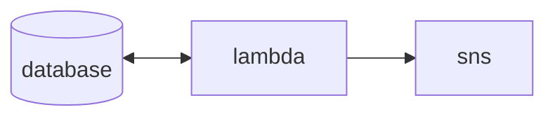

```py
88""Yb 8888b.     db    Yb  dP 
88__dP  8I  Yb   dPYb    YbdP  
88""Yb  8I  dY  dP__Yb    8P   
88oodP 8888Y"  dP""""Yb  dP    
```

For remembering birthdays.

## Developing

Setup & dependencies

```sh
poetry shell
poetry install
```

CLI

```sh
Usage: bday [OPTIONS] COMMAND [ARGS]...

  bday cli

Options:
  --help  Show this message and exit.

Commands:
  add  Add a birthday
  get  Get a birthday
  ls   List birthdays
```

Infrastructure



```sh
# AWS credential setup
export AWS_ACCESS_KEY_ID=
export AWS_SECRET_ACCESS_KEY=

terraform init                          # initialize terraform
terraform workspace select [dev|prod]   # select environment
terraform plan                          # view changes
terraform apply                         # apply changes
```

Database schema

Key | Type | Description | Example
---|---|---|---
BirthDt | str | **Partition Key** combination of `{month}:{day}` with prefixed zeros, used for getting all birthdays on this day | `"01:18"`
Id | str | **Sort Key** 10-character unique ID for a bday entry | `"y8vVvHl4Iu"`
BirthDay | int | Day number (1-31) | `18`
BirthMonth | int | Month number (1-12) | `1`
BirthYear | int | Year number | `1975`
Name | str | Person's name | `"Leslie Knope"`
CreatedAt | str | Item created time, ISO format | `"2024-10-16T17:15:23.991353"`
UpdatedAt | str | Item updated time, ISO format | `"2024-10-16T17:15:23.991353"`
