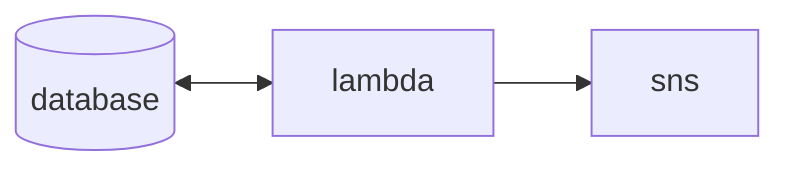

```py
88""Yb 8888b.     db    Yb  dP 
88__dP  8I  Yb   dPYb    YbdP  
88""Yb  8I  dY  dP__Yb    8P   
88oodP 8888Y"  dP""""Yb  dP    
```

For remembering birthdays.

## Developing

Setup & dependencies

```sh
poetry shell
poetry install
```

Manage birthdays

```sh
bday add [--year] --month --day --name
bday rm "name"
bday ls [--month] [--day]
```

Infrastructure



```sh
# AWS credential setup
export AWS_ACCESS_KEY_ID=
export AWS_SECRET_ACCESS_KEY=

terraform init                          # initialize terraform
terraform workspace select [dev|prod]   # select environment
terraform plan                          # view changes
terraform apply                         # apply changes
```

Database item example

```json
{
 "Id": "y8vVvHl4Iu",
 "BirthDt": "01:18",
 "BirthDay": 18,
 "BirthMonth": 1,
 "BirthYear": 1975,
 "CreatedAt": "2024-10-16T17:15:23.991353",
 "Name": "Leslie Knope",
 "UpdatedAt": "2024-10-16T17:15:23.991353"
}
```